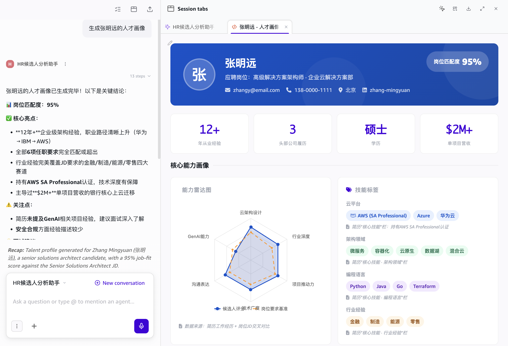
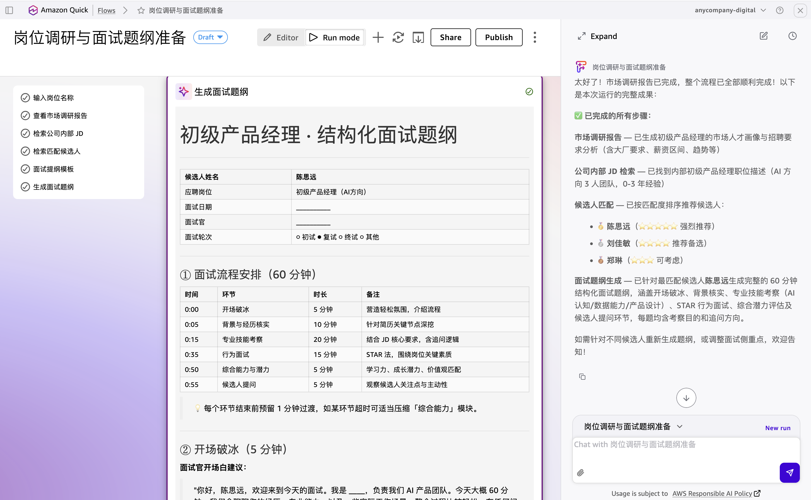
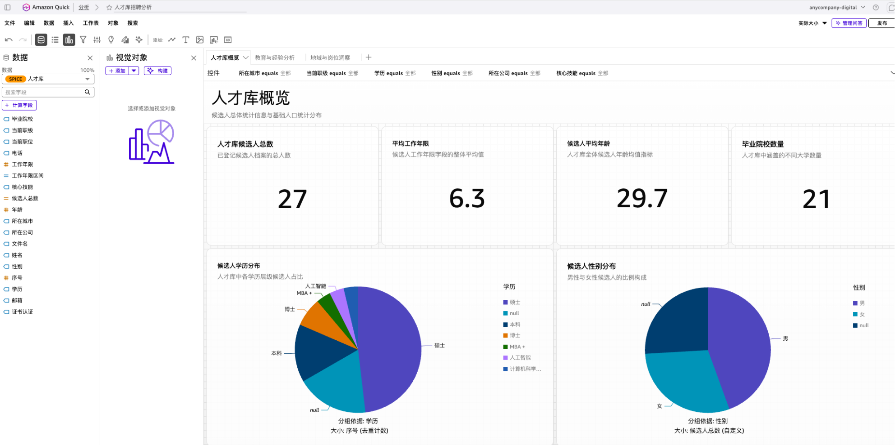
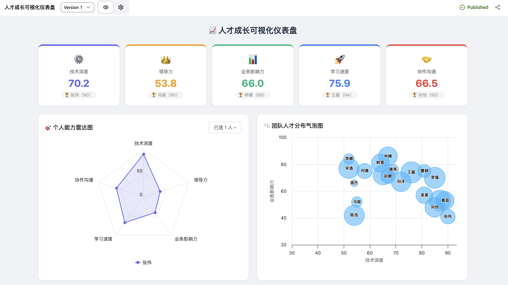
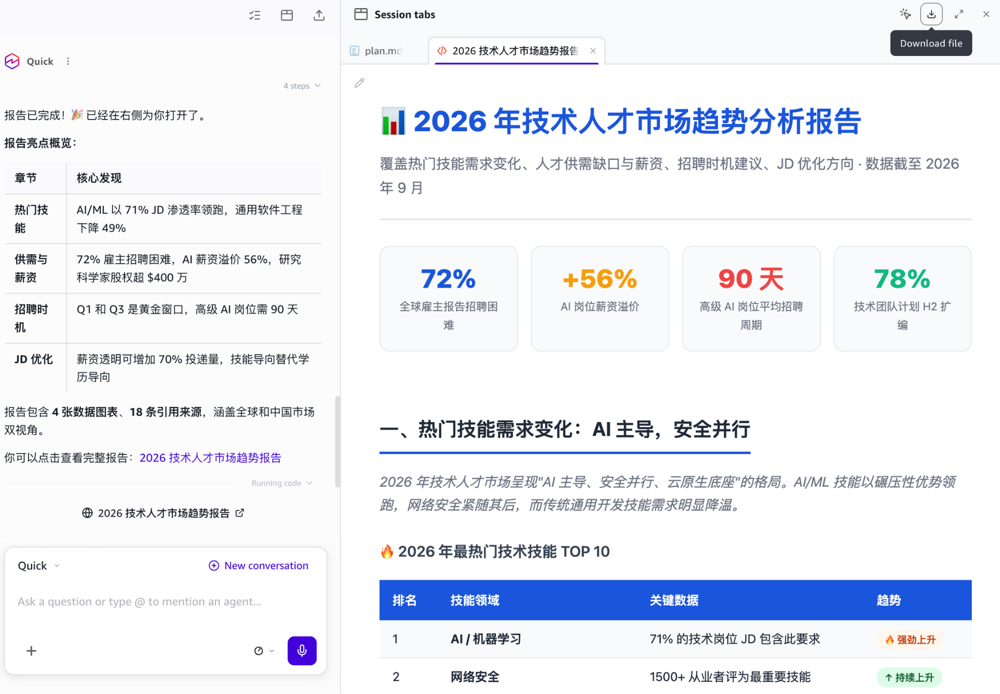

# HR Quick Workshop

基于 Amazon Quick 的 HR 全流程 AI 实践素材包，覆盖候选人分析、岗位调研与面试准备、简历结构化与人才库分析、人才成长可视化及市场人才趋势研究五大场景，综合运用 Spaces、Chat Agent、Flows、Skills、Analyses / Dashboard、Apps 与 Deep Research。

你可以按 `00 → 04` 完整体验，也可以选择单个模块独立练习。每个模块均配有 PDF 操作手册；部分模块还提供演示视频、Prompt 模板、Skill、技术规范和模拟数据。

> 本项目中的候选人、联系方式、公司经历、岗位及招聘数据均为虚拟素材，仅用于 Workshop 演示。

## 你将完成什么

| 模块 | 业务场景 | 使用能力 | 最终产出 | 参考用时 |
| --- | --- | --- | --- | --- |
| 00 | 候选人分析与面试辅助 | Spaces、Chat Agent | 可查询简历、匹配岗位、跟踪面试并生成人才画像的 HR 助手 | 5–10 分钟 |
| 01 | 岗位调研与面试准备 | Spaces、Flows | 从市场调研到面试题纲生成的自动化工作流 | 10–15 分钟 |
| 02 | 简历结构化与人才库分析 | Skills、Dataset、Analyses、Dashboard | 结构化人才库 CSV 与招聘分析 Dashboard | 20–30 分钟 |
| 03 | 人才成长可视化 | Spaces、Apps | 包含 KPI、雷达图、气泡图、热力图和排行榜的人才成长 App | 10–15 分钟 |
| 04 | 市场人才趋势与招聘建议 | Spaces、Web Search、Deep Research | 可预览和下载的技术人才市场研究报告 | 10–15 分钟 |

## 开始之前

请准备可使用相关功能的 Amazon Quick 环境，并建议同时打开：

- Quick Web 端：创建 Spaces、Chat Agent、Flows、Dataset、Analyses、Dashboard 和 Apps。
- Quick 桌面端：导入 Skill、发起带 Space 的对话，以及运行 Deep Research。
- 本项目目录：上传对应模块提供的简历、JD、表格、模板和技术规范。

建议先阅读相应模块的 PDF 手册，再按照 README 的模块摘要执行。界面名称或入口如有变化，请以当前 Amazon Quick 页面为准。

## 推荐体验顺序

```text
简历 / JD 等模拟资料
        │
        ├── 00 候选人分析助手 ───────→ 日常问答、岗位匹配、人才画像
        │
        ├── 01 岗位调研工作流 ───────→ 市场调研、候选人筛选、面试题纲
        │
        ├── 02 简历结构化抽取 ───────→ talent_pool.csv、人才 Dashboard
        │
        ├── 03 人才成长可视化 ───────→ 团队能力分析 App
        │
        └── 04 市场人才趋势分析 ─────→ Deep Research 招聘建议报告
```

## 模块说明

### 00｜HR 候选人分析助手

使用简历、岗位 JD 和面试进展表构建两个知识空间，再创建一个面向 HR 团队的 Chat Agent。

完成后可以：

- 按姓名、技能、经历、岗位等条件查询候选人。
- 基于简历事实比较候选人，并提供岗位匹配建议。
- 查询面试进展、流程和统计信息，同时展示信息出处。
- 在信息不足时主动追问，而不是凭空补全。
- 基于简历事实生成可直接展示的 HTML 候选人人才画像。

核心流程：

1. 创建 `简历` Space，上传根目录中的样例简历和 `面试进展跟踪表.xlsx`。
2. 创建 `岗位 JD` Space，上传模块 `JD/` 中的岗位描述。
3. 创建“HR 面试助手”Chat Agent，配置手册中的 Persona / Prompt。
4. 将两个 Space 设为知识源，完成配置后发布 Agent。
5. 在桌面端打开 Agent，通过候选人查询、岗位推荐、面试进展和“人才画像”等问题验证结果。

配套材料：

- [Workshop 手册](HR-Quick-Workshop/00%20HR候选人分析助手/00%20HR候选人分析助手操作手册.pdf)
- [面试进展跟踪表](HR-Quick-Workshop/00%20HR候选人分析助手/面试进展跟踪表.xlsx)
- [岗位 JD 目录](HR-Quick-Workshop/00%20HR候选人分析助手/JD)



### 01｜岗位调研与面试题纲准备工作流

通过 Flows 把多阶段招聘准备任务串联起来。HR 只需输入岗位名称，工作流就会自动完成市场研究、内部 JD 检索、候选人匹配和面试题纲生成。

完整流程包含：

1. 接收 HR 输入的岗位名称。
2. 调研市场招聘要求、热门能力和薪资待遇，并重点参考国内互联网企业。
3. 从 `JD` Space 检索公司的对应岗位描述。
4. 综合市场报告和内部 JD，从 `Resume` Space 匹配候选人。
5. 读取面试题纲模板，生成适合一小时面试的结构化题纲。

手册还要求为调研步骤增加时效和篇幅限制，确认两个检索步骤分别连接正确的 Space，并在 Run Mode 中完成端到端测试。示例岗位为“AI 销售”。

配套材料：

- [Workshop 手册](HR-Quick-Workshop/01%20岗位调研与面试题纲准备工作流/01%20岗位调研与面试题纲准备工作流.pdf)
- [面试题纲模板](HR-Quick-Workshop/01%20岗位调研与面试题纲准备工作流/interview_outline_template.docx)



### 02｜简历结构化抽取与人才 Dashboard

将不同格式的简历批量转换为统一的人才库数据，再通过 Dataset 和 Analyses 生成可筛选、可发布的招聘分析 Dashboard。

核心流程：

1. 创建 `简历` Space，先上传 `简历/` 中的初始样例，不上传 `补充简历/`。
2. 在桌面端导入并启用 `resume-intake-pipeline-SKILL.md`。
3. 新建对话、附加 `简历` Space，并输入“处理新简历”。
4. Skill 扫描 PDF、DOCX、MD 简历，提取字段并生成或更新 `talent_pool.csv`。
5. 将 CSV 上传到 Quick，创建并发布 Dataset。
6. 使用自然语言生成招聘分析，包括候选人总数、平均工作年限、学历结构、工作年限分布、期望城市、来源公司和岗位意向等视图。
7. 发布 Dashboard；后续加入补充简历后重新运行 Skill、替换 Dataset 文件，即可同步刷新分析。

Skill 支持增量处理和定时运行，结构化字段包括姓名、年龄、学历、院校、专业、工作年限、当前职位与公司、职业路径、技能、行业、求职意向、期望城市和薪资等。

配套材料：

- [创建指南](HR-Quick-Workshop/02%20简历结构化抽取%20%20&%20人才%20Dashboard/02%20简历结构化抽取%20&%20人才%20Dashboard%20创建指南.pdf)
- [简历入库 Skill](HR-Quick-Workshop/02%20简历结构化抽取%20%20&%20人才%20Dashboard/resume-intake-pipeline-SKILL.md)
- [初始及补充简历](HR-Quick-Workshop/简历)



### 03｜人才成长可视化

把分散在员工成长记录中的能力评分提取成 CSV，并使用 Quick Apps 生成一个可发布、可分享的人才成长可视化应用。

数据字段包括姓名、年龄、职级、职位，以及技术深度、领导力、业务影响力、学习成长速度、协作与沟通五项评分。

最终 App 包含：

- 五维 KPI 卡片：展示团队平均分和各维度最高分人员。
- 个人能力雷达图：支持选择人员及多人叠加比较。
- 团队人才分布气泡图：技术深度为 X 轴、业务影响力为 Y 轴、学习速度决定气泡大小。
- 全员能力热力图：按人员和五项能力展示分数及颜色深浅。
- 综合实力排行榜：按五维总分从高到低排列。

核心流程：

1. 创建 `人才成长记录` Space，上传 `人才成长信息/` 文件夹。
2. 在桌面端附加该 Space，使用手册提供的 Prompt 生成 `talent_scores.csv`。
3. 在 Quick Web 的 Apps 中上传 `technicalSpec.md`，再提交手册中的建站 Prompt。
4. 授权 App 读取 Space 数据，等待生成并检查各图表。
5. Publish 后分享 App 链接。

`technicalSpec.md` 规定了全局背景、Highcharts 模块、图表错误隔离、UTF-8 BOM / 换行解析和空数据保护等要求，用于减少应用白屏和局部图表崩溃。

配套材料：

- [操作手册](HR-Quick-Workshop/03%20人才成长可视化/03%20人才成长可视化操作手册.pdf)
- [附件.md](HR-Quick-Workshop/03%20人才成长可视化/technicalSpec.md)
- [人才成长信息](HR-Quick-Workshop/03%20人才成长可视化/人才成长信息)



### 04｜定期市场人才趋势分析与招聘建议

结合企业自己的简历与 JD 知识库以及 Web Search，通过 Deep Research 生成外部人才市场趋势报告，为招聘规划和 JD 优化提供参考。

示例研究内容包括：

- 热门技术与技能需求变化。
- 人才供需缺口和薪资变化。
- 招聘窗口与招聘时机建议。
- 基于市场情况的 JD 优化方向。

核心流程：

1. 创建 `简历` 和 `JD` 两个 Space，分别上传根目录简历与模块 00 的 JD。
2. 在 Quick 桌面端发起新对话，同时附加两个 Space 并启用 Web Search。
3. 输入手册提供的 2026 年技术人才市场分析需求。
4. 查看并确认研究计划，批准 Deep Research 任务开始执行。
5. 跟踪研究进度，完成后查看摘要、预览 HTML 报告并下载保存。

实际使用时，可把研究主题、目标岗位、地区、行业和时间范围替换为团队当前的招聘需求；若跨年度使用，也应同步更新 Prompt 中的年份。

配套材料：

- [Deep Research 操作指南](HR-Quick-Workshop/04%20定期市场人才趋势分析+招聘建议/04%20定期市场人才趋势分析+招聘建议.pdf)



## 目录结构

```text
HR-Quick-Workshop/
├── README.md
├── 00 HR候选人分析助手/
│   ├── 00 HR候选人分析助手操作手册.pdf
│   ├── JD/
│   └── 面试进展跟踪表.xlsx
├── 01 岗位调研与面试题纲准备工作流/
│   ├── 01 岗位调研与面试题纲准备工作流.pdf
│   └── interview_outline_template.docx
├── 02 简历结构化抽取  & 人才 Dashboard/
│   ├── 02 简历结构化抽取 & 人才 Dashboard 创建指南.pdf
│   └── resume-intake-pipeline-SKILL.md
├── 03 人才成长可视化/
│   ├── 03 人才成长可视化操作手册.pdf
│   ├── technicalSpec.md
│   └── 人才成长信息/
├── 04 定期市场人才趋势分析+招聘建议/
│   └── 04 定期市场人才趋势分析+招聘建议.pdf
└── 简历/
    ├── 初始样例简历
    └── 补充简历/
```

## 常见注意事项

- 发起对话或运行 Skill 前，确认已经附加正确的 Space。
- JD 与简历应放入不同 Space，避免工作流检索到错误的数据源。
- 模块 02 首次运行时不要上传“补充简历”，这样才能体验增量入库和 Dashboard 刷新。
- 模块 03 创建 App 时必须上传 `technicalSpec.md`，并检查图表依赖、错误隔离及空数据提示。
- Deep Research 会要求确认研究计划；批准后任务才会在后台执行。
- AI 输出用于辅助 HR 判断，不应替代必要的人工审核、面试评估与合规检查。

## 项目截图

README 中使用的模块截图统一存放在 `docs/images/`：

```text
docs/images/
├── 00-candidate-analysis.png
├── 01-interview-flow.png
├── 02-talent-dashboard.png
├── 03-talent-growth-app.png
└── 04-market-research.png
```

如需替换截图，请保持文件名不变，以免 README 中的图片链接失效。
